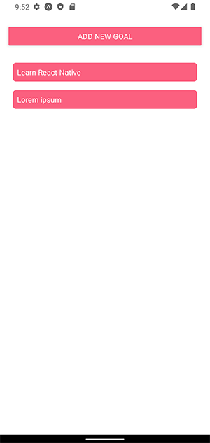
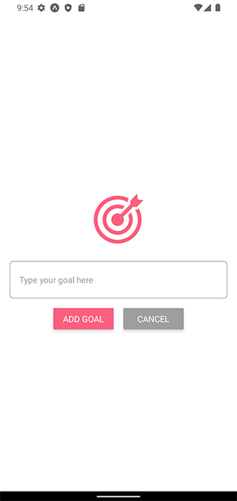

# react-native-goals-app

This React Native app is built with Expo CLI.

 

## How to Use

```
npm install
```

```
npm run start
```

Expo CLI allows you to run your React Native app on a physical device without setting up a development environment. Install the [Expo](https://expo.io/) client app on your iOS or Android phone and connect to the same wireless network as your computer. On Android, use the Expo app to scan the QR code from your terminal to open your project. On iOS, use the built-in QR code scanner of the Camera app.

### Running your app on a simulator or virtual device

If you want to run your app on the iOS Simulator or an Android Virtual Device, you can launch your app on an Android Virtual Device by running `npm run android`, or on the iOS Simulator by running` npm run ios` (macOS only).
